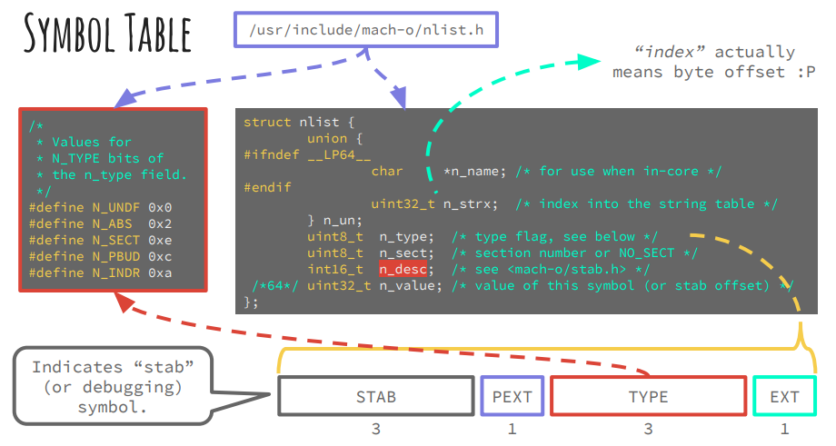

# symbol


## nlist定义



### nlist_64定义

```c
struct nlist_64 {
    union {
        uint32_t  n_strx; /* index into the string table */
    } n_un;
    uint8_t n_type;        /* type flag, see below */
    uint8_t n_sect;        /* section number or NO_SECT */
    uint16_t n_desc;       /* see <mach-o/stab.h> */
    uint64_t n_value;      /* value of this symbol (or stab offset) */
};
/*
 * Symbols with a index into the string table of zero (n_un.n_strx == 0) are
 * defined to have a null, "", name.  Therefore all string indexes to non null
 * names must not have a zero string index.  This is bit historical information
 * that has never been well documented.
 */

/*
 * The n_type field really contains four fields:
 *	unsigned char N_STAB:3,
 *		      N_PEXT:1,
 *		      N_TYPE:3,
 *		      N_EXT:1;
 * which are used via the following masks.
 */
#define	N_STAB	0xe0  /* if any of these bits set, a symbolic debugging entry */
#define	N_PEXT	0x10  /* private external symbol bit */
#define	N_TYPE	0x0e  /* mask for the type bits */
#define	N_EXT	0x01  /* external symbol bit, set for external symbols */
```

## 举例

* MachOView查看到的`Symbol Table`
  * 
    * 说明
      * String表的偏移量是`0xbbff8`, 翻译后是`[GMRYouHaoHuoReq getRequestURL]`
      * 地址是`0x100003300`
