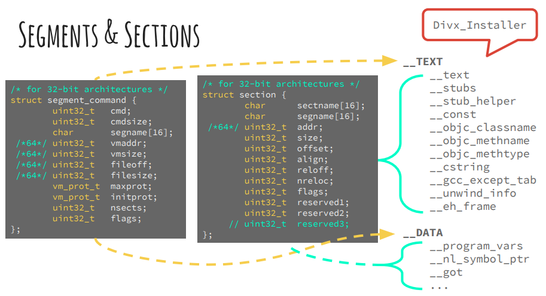

# segment

* Mach-O中包含1个或多个segment
  * 一个segment中包含0或多个section
* segment和sectoin的基本定义
  * 

## 常见segment

* 概述
  * 最常用的segment：`__PAGEZERO`、`__TEXT`、`__DATA`、`__LINKEDIT`
    * 举例
      * MachOView查看某Mach-O的效果
        * 
* 详解
  * `__PAGEZERO`
    * The static linker creates a `__PAGEZERO` segment as the first segment of an executable file. This segment is located at virtual memory location 0 and has no protection rights assigned, the combination of which causes accesses to NULL, a common C programming error, to immediately crash. The `__PAGEZERO` segment is the size of one full VM page for the current architecture (for Intel-based and PowerPC-based Macintosh computers, this is 4096 bytes or 0x1000 in hexadecimal). Because there is no data in the `__PAGEZERO` segment, it occupies no space in the file (the file size in the segment command is 0).
  * `__TEXT`
    * The `__TEXT` segment contains executable code and other read-only data. To allow the kernel to map it directly from the executable into sharable memory, the static linker sets this segment’s virtual memory permissions to disallow writing. When the segment is mapped into memory, it can be shared among all processes interested in its contents. (This is primarily used with frameworks, bundles, and shared libraries, but it is possible to run multiple copies of the same executable in OS X, and this applies in that case as well.) The read-only attribute also means that the pages that make up the `__TEXT` segment never need to be written back to disk. When the kernel needs to free up physical memory, it can simply discard one or more `__TEXT` pages and re-read them from disk when they are next needed.
  * `__DATA`
    * The `__DATA` segment contains writable data. The static linker sets the virtual memory permissions of this segment to allow both reading and writing. Because it is writable, the `__DATA` segment of a framework or other shared library is logically copied for each process linking with the library. When memory pages such as those making up the `__DATA` segment are readable and writable, the kernel marks them copy-on-write; therefore when a process writes to one of these pages, that process receives its own private copy of the page.
  * `__OBJC`
    * The __OBJC segment contains data used by the Objective-C language runtime support library.
  * `__IMPORT`
    * The __IMPORT segment contains symbol stubs and non-lazy pointers to symbols not defined in the executable. This segment is generated only for executables targeted for the IA-32 architecture.
  * `__LINKEDIT`
    * The __LINKEDIT segment contains raw data used by the dynamic linker, such as symbol, string, and relocation table entries.

## 主要segment的section

* segment段
  * `__TEXT`段
    * Section节
      * `__text`: The compiled machine code for the executable
      * `__const`: The general constant data for the executable
      * `__cstring`: Literal string constants (quoted strings in source code)
      * `__picsymbol_stub`: Position-independent code stub routines used by the dynamic linker (dyld)
  * `__DATA`段
    * Section节
      * `__data`: Initialized global variables (for example `int a = 1;` or `static int a = 1;`)
      * `__const`: Constant data needing relocation (for example, `char * const p = "foo";`)
      * `__bss`: Uninitialized static variables (for example, `static int a;`)
      * `__common`: Uninitialized external globals (for example, `int a;` outside function blocks)
      * `__dyld`: A placeholder section, used by the dynamic linker
      * `__la_symbol_ptr`: **Lazy** symbol pointers. Symbol pointers for each undefined function called by the executable
      * `__nl_symbol_ptr`: **Non lazy** symbol pointers. Symbol pointers for each undefined data symbol referenced by the executable

### 举例

某个段表的详情：

```bash
# Sections:
# Address    Size        Segment    Section
0x100001DC0    0x00A38B42    __TEXT    __text
0x100A3A902    0x00001C9E    __TEXT    __stubs
0x100A3C5A0    0x0000204A    __TEXT    __stub_helper
0x100A3E5EC    0x000231B0    __TEXT    __gcc_except_tab
0x100A617A0    0x000178D0    __TEXT    __const
0x100A79070    0x0008A5DA    __TEXT    __cstring
0x100B0364A    0x0005F462    __TEXT    __objc_methname
0x100B62AAC    0x00008794    __TEXT    __objc_classname
0x100B6B240    0x0003B4EB    __TEXT    __objc_methtype
0x100BA672C    0x00001742    __TEXT    __ustring
0x100BA7E6E    0x00000172    __TEXT    __entitlements
0x100BA7FE0    0x0000037B    __TEXT    __dof_RACSignal
0x100BA835B    0x000002E8    __TEXT    __dof_RACCompou
0x100BA8644    0x00012964    __TEXT    __unwind_info
0x100BBAFA8    0x00000058    __TEXT    __eh_frame
0x100BBB000    0x00000008    __DATA    __nl_symbol_ptr
0x100BBB008    0x00000BD8    __DATA    __got
0x100BBBBE0    0x00002628    __DATA    __la_symbol_ptr
0x100BBE208    0x00000070    __DATA    __mod_init_func
0x100BBE280    0x0001CEE0    __DATA    __const
0x100BDB160    0x00039CA0    __DATA    __cfstring
0x100C14E00    0x00002B00    __DATA    __objc_classlist
0x100C17900    0x000000A0    __DATA    __objc_nlclslist
0x100C179A0    0x00000680    __DATA    __objc_catlist
0x100C18020    0x000000D0    __DATA    __objc_nlcatlist
0x100C180F0    0x00000638    __DATA    __objc_protolist
0x100C18728    0x00000008    __DATA    __objc_imageinfo
0x100C18730    0x001252F8    __DATA    __objc_const
0x100D3DA28    0x000150B0    __DATA    __objc_selrefs
0x100D52AD8    0x00000150    __DATA    __objc_protorefs
0x100D52C28    0x00002A38    __DATA    __objc_classrefs
0x100D55660    0x000019F8    __DATA    __objc_superrefs
0x100D57058    0x000085E8    __DATA    __objc_ivar
0x100D5F640    0x0001AE00    __DATA    __objc_data
0x100D7A440    0x0000CC70    __DATA    __data
0x100D870B0    0x00004698    __DATA    __bss
0x100D8B750    0x00001298    __DATA    __common
```

