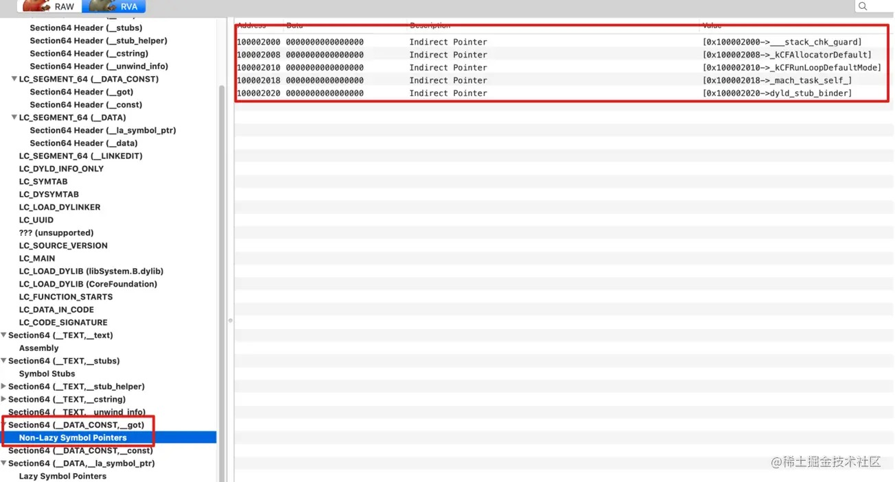
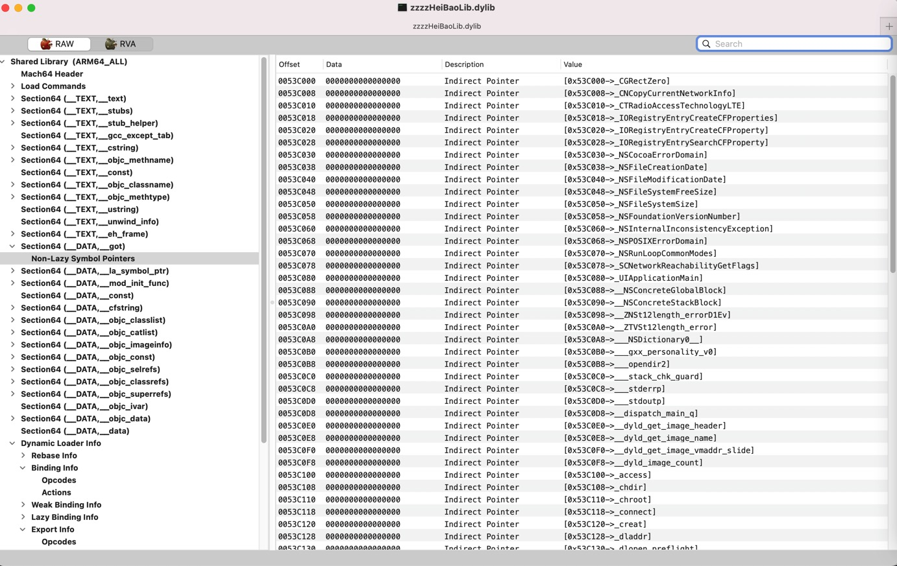

# __DATA,__got

* `GOT`=`Global Offset Table`=`全局符号偏移表`
  * 解释
    * iOS 开发中，动态库是个绕不开的话题，系统库基本上是动态库。它的一大优势是节约内存，可让多个程序映射同一份的动态库，实现代码共享。动态库本身也是一个 Mach-O 文件，也有数据段、代码段等。其中代码段可读可执行，数据段可读可写。
    * 动态库共享的只是代码段部分，为了达到代码段共享的目的，其符号地址在生成时就不能写死，因为它映射到每个程序中虚拟内存空间中的位置可能不一样。对于数据段部分，由于各个程序会对其进行修改，因此每个程序会单独映射一份。
    * 那么如何解决代码段共享的问题呢？聪明的人们，想出一种精妙的解决方式。通过添加一个中间层，到另一个表中去查找符号的地址。这个表就叫`got`=`global offset table`=`全局符号偏移表`，然后在运行时绑定地址信息，将地址填入到 `got` 中。这样代码段中的符号就与具体地址无关，只和 got 中的数据有关。这种方式就叫 `PIC`=`Program Independent Code`=`地址无关代码`

## 举例

* MachOView查看
  * 某程序
    * 
  * zzzzHeiBaoLib.dylib
    * 
    * 
