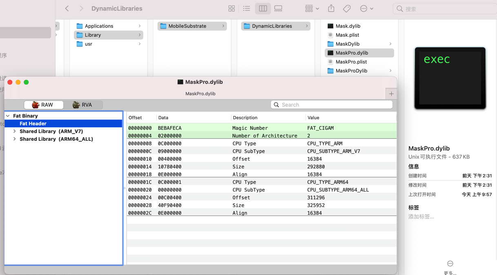
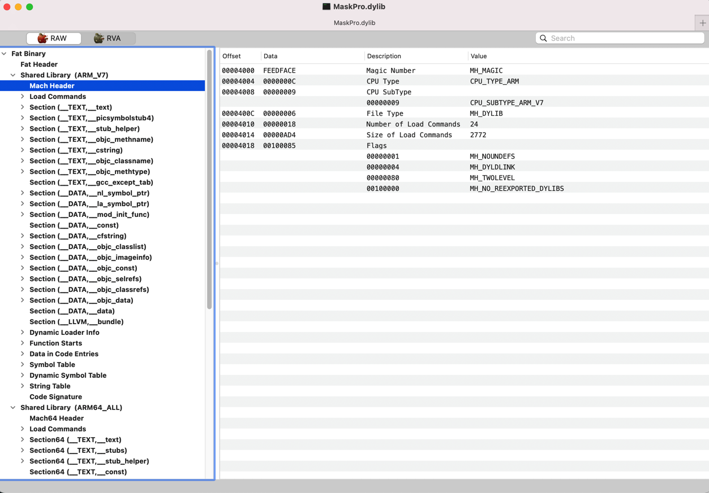
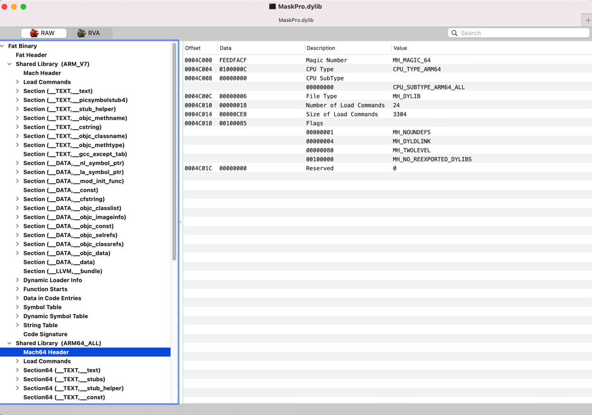

# FAT

* `Fat Binary`=`胖二进制`=`Fat File`=`胖二进制文件`=`Universal Binary`=`通用二进制文件`
  * 把多个架构的二进制（比如`armv7`、`arm64`等）合并在一起，成了个胖子，所以叫`Fat Binary`
    * 一个由**不同的编译架构**后的`Mach-O`产物所合成的集合体
    * 一个架构的`Mach-O`只能在相同架构的机器或者模拟器上用
    * 为了支持不同架构需要一个集合体
  * 文件大小
    * 一般比单一架构的文件要大
    * 但是由于多架构会共用一部分资源，所以往往比多个（常常是2个）的总大小要小


---

* `file`：查看Mach-O的文件类型
  * `file inputMacOFile`

TODO：把 
可执行文件格式
https://book.crifan.org/books/executable_file_format/website/
中的例子，整理过来。

---

## 常见问题

### Select an architecture setting the ARCH= environment variable

折腾Mask的dylib期间就遇到了`FAT Binary`：

```bash
➜  DynamicLibraries jtool2 -h MaskPro.dylib > MaskProDylib/MaskProDylib_jtool2_h_header.txt
Fat binary, little-endian, 2 architectures: armv7, arm64
Select an architecture setting the ARCH= environment variable
```

即，一个Dylib中，包含了多种架构，此处是`armv7`和`arm64`

此处要指定具体架构，才能继续用`jtool2`查看信息：

```bash
➜  DynamicLibraries export ARCH=arm64
➜  DynamicLibraries jtool2 -h MaskPro.dylib > MaskProDylib/MaskProDylib_jtool2_h_header.txt
```

类似的，后续去用`MachOView`查看信息，也能看到是：`FAT Binary`

* 
  * ARMV7
    * 
  * ARM64
    * 
