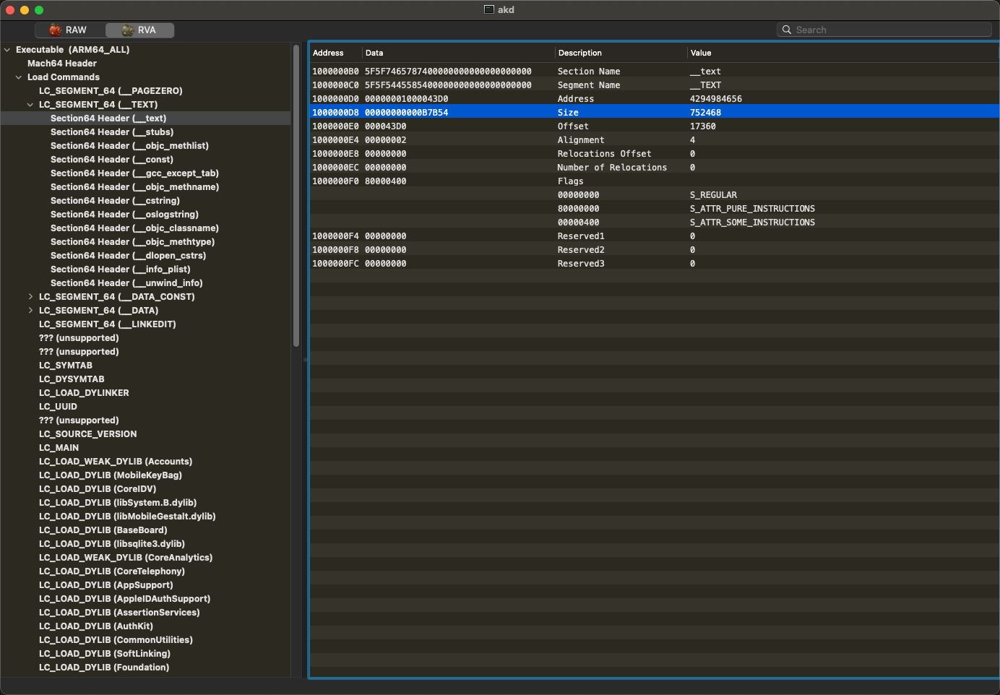
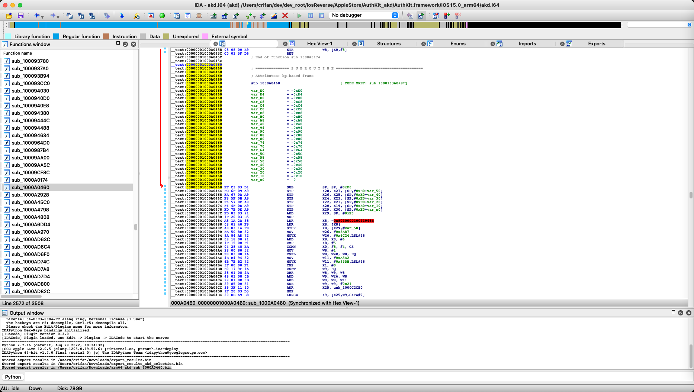

# 虚拟地址

* 关于虚拟地址
  * Mach-O中相关定义：`segment段`和`section节`中的部分定义
    * `segment_command_64`中有对应字段
      * `vmaddr`
        * `VM Address`=`虚拟内存地址`
          * 当程序被加载到内存中后，对应的（虚拟）内存地址
            * 注：现代CPU都支持（映射后的）虚拟内存
      * `vmsize`
        * 虚拟内存中的程序大小
          * 目前所见过的所有情况中，此值都是和文件大小一样
    * `section_64`
      * `addr`
        * 虚拟内存地址
          * 不是我们从硬盘中读取的偏移量地址
      * `size`
        * 大小，单位是字节
          * 适用于虚拟内存地址和文件偏移量
      * `offset`
        * （磁盘中的）文件内的偏移量

* 一般来说：
  * 有2个偏移量=地址
    * `虚拟内存`=`vm`
    * `文件`=`file`
  * 对应分别常被简称为
    * `vmoff`
    * `fileoff`
  * 举例
    * 最开始的起始地址
      * `fileoff` = 0x0
      * `vmoff`= 0x100000000
        * 程序常被映射到虚拟内存地址0x100000000
* 进一步说：
  * 其实有3个常见地址相关名词
    * `VA`=`Virtual Address`=`虚拟地址`
      * ==`VM Address`=`虚拟内存地址`
    * `RVA`=`Relative Virtual Address`=`相对的虚拟地址`
      * 相对于谁：`ImageBase`=`二进制镜像文件的基地址`
    * `File Offset`=`文件内偏移量`
      * `file_off` = (`address` - `seg.address`) + `seg.offset`
  * 举例
    * `Virtual Address = 0x00401000`
      * `ImageBase = 0x00400000`
        * `RVA = 0x00001000`
    * MachOView中能看到：
      * 2种显示模式
        * `RAW`=原始地址=虚拟地址
        * `RVA`=相对虚拟地址 = 类似于`VA`的概念
          * 比如：`baseAddress`=`基地址`=`VM Address`=`虚拟内存基地址`：`0x100000000`
            * `File Offset`地址：`0xA0460`  -> 变成了 `RVA`地址：`0x1000A0460`
      * 举例
        * `akd`
          * `RAW`
            * 
          * `RVA`
            * 
    * IDA中的地址是：加了基地址后的`RVA`地址
      * 
