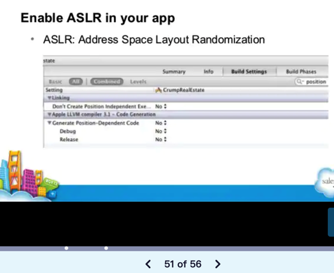
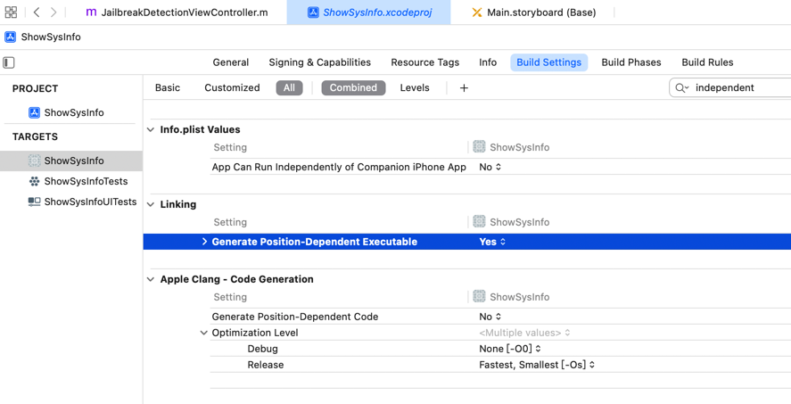

# PIC

* `PIC`=`Position-Independent Code`=`位置无关代码`
  * 详解
    * 位置无关代码（PIC）是 PowerPC 环境中使用的代码生成技术的名称，该技术允许动态链接器在非固定虚拟内存地址加载代码区域。如果没有某种形式的与位置无关的代码生成，操作系统将需要将您想要共享的所有代码放置在虚拟内存中的固定地址，这将使操作系统的维护变得非常困难。例如，支持共享库和框架几乎是不可能的，因为每个库和框架都需要预先分配一个永远不会改变的地址。
    * `Mach-O`与位置无关的代码设计基于这样的观察：`__DATA` 段始终位于距 `__TEXT` 段恒定的偏移处。也就是说，动态加载器在加载任何`Mach-O`文件时，绝不会相对于其 `__DATA` 段移动文件的 `__TEXT` 段。因此，函数可以使用自己的当前地址加上固定偏移量来确定它希望访问的数据的位置。 `Mach-O`文件的所有段（不仅是 `__TEXT` 和 `__DATA` 段）相对于其他段的偏移量是固定的。
  * 官网文档
    * [Position-Independent Code](https://developer.apple.com/library/archive/documentation/DeveloperTools/Conceptual/MachOTopics/1-Articles/dynamic_code.html#//apple_ref/doc/uid/TP40002528)
  * 对比
    * `Mach-O`的`PIC` ~= [ELF](https://book.crifan.org/books/exec_file_format_elf/website/)的`GOT`
      * 区别：Mach-O 代码使用直接偏移引用数据，而 ELF 通过全局偏移表间接访问所有数据。
  * `PIC` 
    * ~= `PIE` = `Position-Independent Executable`
      * 对应的Mach-O中有个flag是：`MH_PIE`
    * ~= `ASLR`

## `ASLR`

* `ASLR`=`Address Space Layout Randomization`=`地址空间布局随机化`

参考：



去尝试给iOS的app去开启ASLR：

* Linking->Generate Position-Dependent Executable
  * 
* Apple Clang - Code Generation->Generate Position-Dependent Code
  * 

结果：

编译都会报错：

```bash
ld: -no_pie and -bitcode_bundle (Xcode setting ENABLE_BITCODE=YES) cannot be used together

Showing All Messages
-no_pie and -bitcode_bundle (Xcode setting ENABLE_BITCODE=YES) cannot be used together
```

看起来是和BITCODE的`ENABLE_BITCODE=YES`相冲突了。

所以暂时放弃深究。

后记：

上述的：

`Position-Dependent Executable`和`Generate Position-Dependent Code`

很明显是：要关闭`ASLR`=`PIC`=`PIE`的意思啊

所以感觉是：

* `ASLR`=`PIC`=`PIE`：默认已开启
  * 如果想要去**关闭**ALSR，才需要去更改设置，改为
    * Linking->Generate Position-Dependent Executable = `YES`
    * Apple Clang - Code Generation->Generate Position-Dependent Code = `YES`
